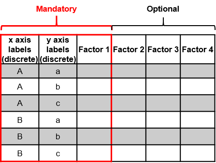
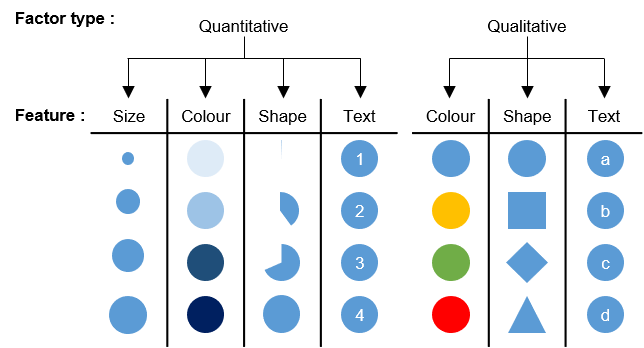
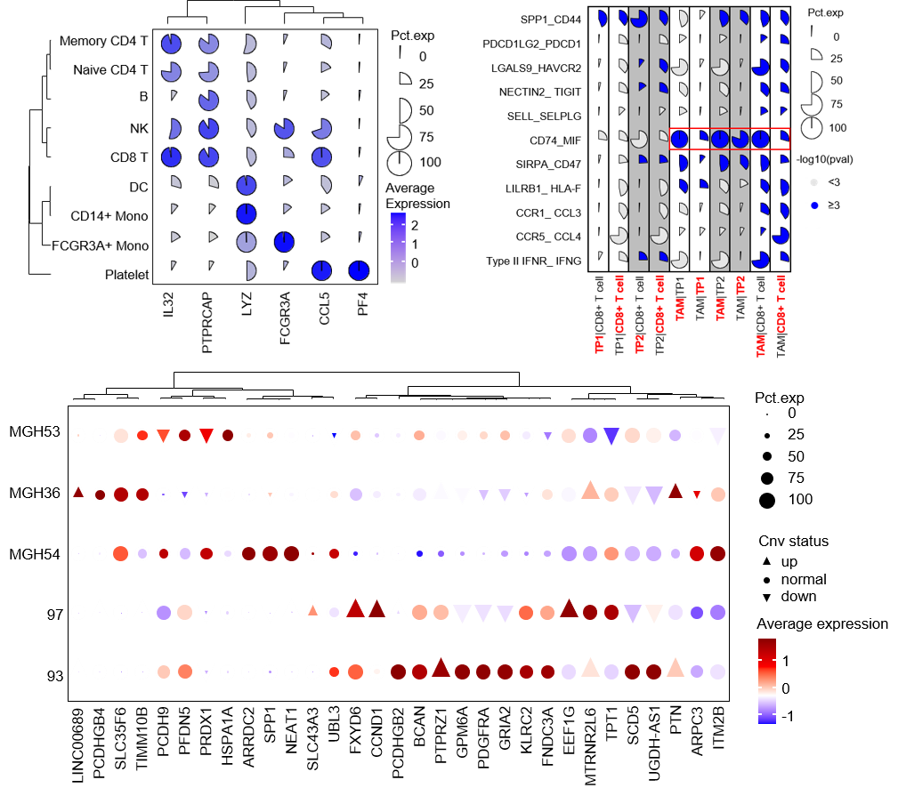

# FlexDotPlot

R package for Flexible dot plots

# Installation

The FlexDotPlot package can be installed from GitHub by running

``` r
install.packages("devtools")
devtools::install_github("Simon-Leonard/FlexDotPlot")
```

# Input

The FlexDotPlot package takes a data frame as input: the first two columns contain the two factors to spread along the x and y axes followed by the corresponding quantitative and/or qualitative data to be displayed :



Users can specify which factor to display on the doplot and how each factor should be displayed :



# Usage

``` r
library(FlexDotPlot)
```

The FlexDotPlot package contains the following functions :

1- The dot_plot() function to generate dot plot with command line. Function help is available with help("dot_plot").

Have a look on the [FlexDotPlot tutorial](https://github.com/Simon-Leonard/FlexDotPlot/blob/master/vignettes/) or on the [scripts to reproduce the article figures](https://github.com/Simon-Leonard/FlexDotPlot_paper) to see how we can use this function in details.

2- The Shiny_dot_plot() function to generate dot plot in an interactive way with a Shiny application.

3- The rotate_dot_plot_dendrogram() function to rotate dendrograms from dot_plot outputs.

# Examples

Here are some plots generated with FlexDotPlot ([scripts to reproduce the figures](https://github.com/Simon-Leonard/FlexDotPlot_paper))



# Reference

Simon Leonard, Aurélie Lardenois, Karin Tarte, Antoine Rolland, Frédéric Chalmel,

FlexDotPlot: a universal and modular dot plot visualization tool for complex multifaceted data,

Bioinformatics Advances, 2022;, vbac019, <https://doi.org/10.1093/bioadv/vbac019>

See also the [FlexDotPlot_paper](https://github.com/Simon-Leonard/FlexDotPlot_paper) repository to get the scripts used for analysis and figure generation in the FlexDotPlot paper

# Contact

Don't hesitate to contact me for any question/suggestion by opening an issue or [sending me an email](mailto:simon_leonard@hotmail.fr)
